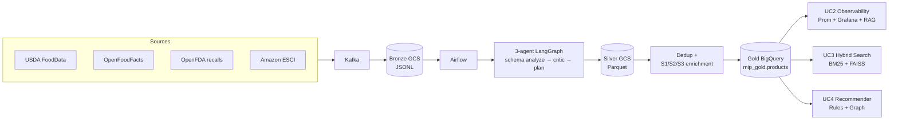
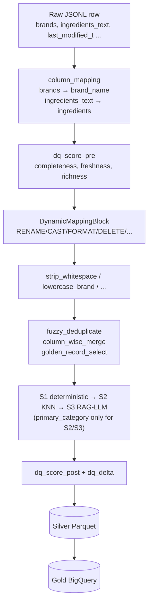
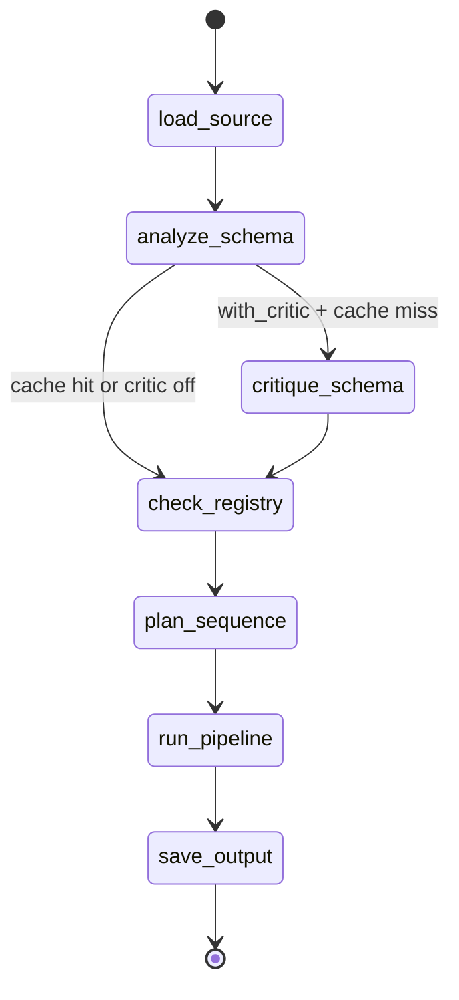

# Marketplace Intelligence Platform (MIP)

Food-product catalog pipeline that ingests heterogeneous sources (USDA FoodData Central, OpenFoodFacts, OpenFDA recalls, Amazon ESCI), produces a unified Bronze → Silver → Gold layer on GCS + BigQuery, and exposes four use cases on top:

- **UC1** — three-agent LangGraph ETL with YAML-only transforms, multi-tier enrichment, DQ scoring
- **UC2** — observability: Prometheus + Grafana, RAG chatbot over run logs, anomaly detection
- **UC3** — hybrid search (BM25 + semantic) across 99,666 indexed products
- **UC4** — association-rule and graph-based recommendations built from 50k Instacart orders (49,688 products, 105 rules, 105 edges)

- streamlit - http://35.239.47.242:8501/
- Live on GCP at **35.239.47.242** — see [`docs/DEPLOYMENT.md`](docs/DEPLOYMENT.md) for the endpoint list.
- Codelabs: https://codelabs-preview.appspot.com/?file_id=1qG3yRCYtzhSTFo97FNTSXtc9i-zMtj7WOxIXy7K4dWI#0
- recording: https://teams.microsoft.com/l/meetingrecap?driveId=b%213uqOjpR9uE6WTxah7h1msZr6jH1n5YJHiA27kQNInRFHnPywmj3uSb5GyiDc1NoG&driveItemId=01WYA5BLQ2BPGE2ZMM2ZGZEBKB7GSNFFY6&sitePath=https%3A%2F%2Fnortheastern-my.sharepoint.com%2F%3Av%3A%2Fg%2Fpersonal%2Fryan_aq_northeastern_edu%2FIQAaC8xNZYzWTZIFQfmk0pceAeKTozP8qnGAegOprfUE80w&fileUrl=https%3A%2F%2Fnortheastern-my.sharepoint.com%2F%3Av%3A%2Fg%2Fpersonal%2Fryan_aq_northeastern_edu%2FIQAaC8xNZYzWTZIFQfmk0pceAeKTozP8qnGAegOprfUE80w&threadId=19%3Acab17817ff2540cd80f6fb9f31cd683f%40thread.v2&organizerId=a0c913ff-abe6-4dec-b9b6-da5a8d07c941&tenantId=a8eec281-aaa3-4dae-ac9b-9a398b9215e7&callId=0bb323be-a18c-4894-ad9c-0a67de3e9aab&threadType=GroupChat&meetingType=Adhoc&subType=RecapSharingLink_RecapChiclet
---

## 1. Problem

Food catalogs arrive in wildly different shapes — USDA's branded-food dump has 150+ nutrient columns, OpenFoodFacts uses multilingual free-text fields, OpenFDA recalls are event records, and ESCI is a search-relevance dataset. Merging them into a single usable catalog requires per-source schema reconciliation, safety-aware enrichment (allergens cannot be guessed), dedup across brand/product variants, and continuous quality scoring. MIP does this without hand-written per-source code — an LLM-driven orchestrator emits declarative YAML transforms that later runs replay deterministically, so new sources onboard without code changes.

---

## 2. Architecture

Five-layer flow: external sources → Kafka → Bronze (GCS JSONL) → 3-agent LangGraph ETL → Silver (GCS Parquet) → dedup + enrichment → Gold (BigQuery) → UC2/3/4 surfaces.



For the full node-by-node diagram (13 nodes, internal state, prompts), see [`docs/ARCHITECTURE.md`](docs/ARCHITECTURE.md).

### Single-record data flow



---

## 3. Three-agent LangGraph



| Agent | Node | Model | Role |
|---|---|---|---|
| **Agent 1 — Orchestrator** | `analyze_schema` | `deepseek/deepseek-chat` | Map source columns to unified schema, emit `RENAME`/`CAST`/`FORMAT`/`DELETE`/`ADD`/`SPLIT`/`UNIFY`/`DERIVE` ops |
| **Agent 2 — Critic** | `critique_schema` *(opt-in with `--with-critic`)* | `anthropic/claude-sonnet-4-6` | Reasoning-model review of Agent 1's plan against 7 deterministic rules |
| **Agent 3 — Planner** | `plan_sequence` | `deepseek/deepseek-chat` | Reorder registered blocks — *cannot* add or remove; missing blocks auto-re-appended before `dq_score_post` |

Redis YAML cache (30d TTL) short-circuits Agents 1–3 on schema-fingerprint hit. Full cacheable blob is written by `plan_sequence_node`, not Agent 1 — change what any of the three agents produce and update that write site, or replayed runs drop state.

**No runtime Python codegen.** All transforms are declarative YAML executing a fixed action set (`set_null`, `type_cast`, `regex_extract`, `concat_columns`, …) via [`DynamicMappingBlock`](src/blocks/dynamic_mapping.py). This is a constitutional constraint — do not reintroduce `exec()`-based generation.

---

## 4. Enrichment cascade (and the safety boundary)

Three tiers for `primary_category`, plus deterministic-only populators for safety fields:

1. **S1 deterministic** ([`src/enrichment/deterministic.py`](src/enrichment/deterministic.py)) — regex + keyword rules over the row's own text. Populates `allergens`, `dietary_tags`, `is_organic`, partial `primary_category`.
2. **S2 KNN** ([`src/enrichment/embedding.py`](src/enrichment/embedding.py)) — FAISS `IndexFlatIP` cosine search against a persistent corpus. Votes neighbors' category above `VOTE_SIMILARITY_THRESHOLD=0.45`.
3. **S3 RAG-LLM** ([`src/enrichment/llm_tier.py`](src/enrichment/llm_tier.py)) — Claude Haiku with S2's top-3 neighbors as context. Used when S2 confidence falls below `CONFIDENCE_THRESHOLD_CATEGORY=0.60`.

> **Hard safety rule.** S2 and S3 touch only `primary_category`. `allergens`, `is_organic`, `dietary_tags` are *never* inferred — they are either extracted from the product's own text (S1) or stay null. A false positive here is a regulatory-grade mistake. See [`docs/DQ_SCORING.md §4`](docs/DQ_SCORING.md) for why nulls still count against completeness.

Corpus persists across runs. S2 and S3 write resolved rows back into the FAISS index, so later runs improve.

---

## 5. Data quality scoring

Per-row score 0–100 blending three signals:

$$\mathrm{dq\_score} = (0.40 \cdot \mathrm{completeness} + 0.35 \cdot \mathrm{freshness} + 0.25 \cdot \mathrm{ingredient\_richness}) \times 100$$

Two scores per row: `dq_score_pre` (before enrichment), `dq_score_post` (after). `dq_delta` is the lift. Reference columns are pinned at pre so enrichment-added columns don't artificially lower completeness at post. Full walkthrough with worked examples on real OFF rows: [`docs/DQ_SCORING.md`](docs/DQ_SCORING.md).

---

## 6. Guardrails

Two layers, both already wired:

- **Structural** — [`src/agents/guardrails.py`](src/agents/guardrails.py). Validates Agent 1/2/3 outputs (op shapes, referenced columns exist, no runtime-Python emit, S3 response schema). 95% coverage.
- **LLM safety** — [`src/agents/safety_guardrails.py`](src/agents/safety_guardrails.py). Prompt-injection + PII-redaction guard on the UC2 RAG chatbot path. Default model `groq/llama-3.1-8b-instant`. 10 passing tests in `tests/unit/test_safety_guardrails.py`.

Both run **fail-closed** on malformed LLM output (reject + retry) and **fail-open** on infrastructure outage (log warning + pass through). Pipeline runs never block on observability or guardrail service failure.

---

## 7. Use cases

| # | What | Entry point | Notes |
|---|---|---|---|
| UC1 | 3-agent schema-driven ETL | `python -m src.pipeline.cli` / `app.py` | LangGraph, YAML cache, DQ scoring |
| UC2 | Observability + RAG chatbot | `app.py` → Mode=Observability, `uvicorn src.uc2_observability.mcp_server:app --port 8001` | Prometheus 12 gauges, ChromaDB audit corpus, Isolation Forest anomalies |
| UC3 | Hybrid search | `src/uc3_search/` | 99,666 products indexed; BM25 + sentence-transformers |
| UC4 | Association-rule + graph recs | `src/uc4_recommendations/` | 49,688 products, 105 rules, 105 edges (50k Instacart orders) |

---

## 8. Data sources × domain schemas

| Source | Domain | Bronze partitions | Silver rows | Role |
|---|---|---|---|---|
| USDA FoodData Central | `nutrition` | `usda/2026/04/{20,21,23}/` + `usda/bulk/2026/04/21/branded/` | ~447k | Primary nutrition catalog |
| OpenFoodFacts | `nutrition` | `off/2026/04/{09 → 22}/` (14 days) | ~7k / day | Best freshness/incremental demo |
| OpenFDA recalls | `safety` | `openfda/2026/04/20/` | ~25k | Safety-domain showcase |
| Amazon ESCI | `retail` | `esci/2024/01/01/`, `esci/2026/04/20/` | ~1.08M | Retail domain + UC3 corpus |

Full inventory with layout quirks and known gaps: [`docs/data_inventory.md`](docs/data_inventory.md).

Canonical schemas live in `config/schemas/<domain>_schema.json` (`nutrition`, `safety`, `pricing`, `retail`, `finance`, `manufacturing`). `pricing`, `finance`, `manufacturing` are defined but no Bronze yet.

---

## 9. EDA highlights

Precomputed across the four anchor tuples:

| Source | Date | Bronze (sample) | Silver | DQ pre mean |
|---|---|---|---|---|
| usda | 2026/04/21 | 2,000 | 447,809 | 27.3 |
| off | 2026/04/22 | 2,000 | 7,094 | 27.3 |
| openfda | 2026/04/20 | 2,000 | 25,100 | 27.3 |
| esci | 2026/04/20 | 2,000 | 1,087,502 | 27.3 |

Full per-anchor artifacts: `output/eda/<source>_<date>/` — `summary.json`, `tables.csv`, `plots/*.png`. Rollup: [`output/eda/SUMMARY.md`](output/eda/SUMMARY.md).

Rebuild or explore live in Streamlit (`Mode=EDA` sidebar option):

```bash
streamlit run app.py
# then pick Mode=EDA → anchor selector → tabs for Shape / Schema diff / Nulls / DQ / Enrichment / Dedup / Categories / Telemetry / UC3-UC4
```

Regenerate artifacts from scratch:

```bash
python scripts/eda_full_report.py --no-bq --bronze-limit 2000
```

---

## 10. Quick start

```bash
# Python 3.11, Poetry
poetry install
cp .env.example .env   # fill ANTHROPIC_API_KEY, DEEPSEEK_API_KEY, GROQ_API_KEY

# Full stack (Kafka, Airflow, Postgres, Prometheus, Pushgateway, Grafana,
#   ChromaDB, Redis, MLflow)
docker-compose -p mip up -d

# Streamlit wizard (HITL gates + EDA + Observability chatbot)
streamlit run app.py

# CLI with checkpoint/resume
python -m src.pipeline.cli --source data/usda_fooddata_sample.csv --domain nutrition
python -m src.pipeline.cli --source gs://mip-bronze-2024/off/2026/04/22/*.jsonl --mode silver
python -m src.pipeline.cli --source ... --with-critic    # enable Agent 2

# Gold layer — separate entry point (Silver Parquet → BigQuery)
python -m src.pipeline.gold_pipeline --source off --date 2026/04/21

# MCP observability API
uvicorn src.uc2_observability.mcp_server:app --host 0.0.0.0 --port 8001

# One-time corpus build (USDA FoodData Central → FAISS)
python scripts/build_corpus.py --limit 10000
```

Endpoint cheat-sheet: [`ENDPOINTS.md`](ENDPOINTS.md) · [`docs/DEPLOYMENT.md`](docs/DEPLOYMENT.md)

---

## 11. Testing

| Metric | Value |
|---|---|
| Coverage (excl. UI/Streamlit) | **81.72%** |
| Total statements | 6,678 (5,457 covered) |
| Tests passing | 920 |
| Test files | 43 (41 unit, 7 integration, 1 property-based) |

Full per-module coverage breakdown: [`docs/TEST_COVERAGE_REPORT.md`](docs/TEST_COVERAGE_REPORT.md).

```bash
poetry run pytest                                 # full suite
poetry run pytest -m "not integration"            # skip GCS-dependent
poetry run pytest tests/unit/test_safety_guardrails.py
cd src && ruff check .
```

---

## 12. Repo layout

```
src/
├── agents/                 # LangGraph nodes, prompts, guardrails
├── blocks/
│   ├── generated/<domain>/ # YAML transforms (declarative action set only)
│   └── *.py                # static blocks: cleaning, dedup, enrichment, DQ
├── cache/                  # Redis client + SQLite fallback
├── consumers/              # Kafka → GCS sink
├── eda/                    # EDA library + Streamlit page
├── enrichment/             # S1 / S2 / S3 tiers + corpus + rate limiter
├── models/                 # LiteLLM wrappers (single UC2 import gateway)
├── pipeline/               # runner, CLI, checkpoint, loaders, writers
├── producers/              # Kafka source producers (OFF, OpenFDA, …)
├── registry/               # block registry + sentinel expansion
├── schema/                 # analyzer, sampler, domain schema models
├── uc2_observability/      # log writer, metrics, chunker, MCP server, chatbot
├── uc3_search/             # hybrid_search, indexer, evaluator
└── uc4_recommendations/    # association_rules, graph_store, recommender

airflow/dags/               # 7 scheduled DAGs (ingest → bronze-to-bq → silver → gold → anomaly)
config/schemas/             # per-domain target schemas
corpus/                     # FAISS index + metadata (persistent)
docs/                       # DEPLOYMENT, ARCHITECTURE, DQ_SCORING, data_inventory, EDA plan, …
scripts/                    # build_corpus, eda_full_report, …
tests/                      # unit + integration + property-based
```

---

## 13. Contributor notes

- **YAML-only transform constraint.** Do not reintroduce runtime Python codegen. The action set in [`src/blocks/dynamic_mapping.py`](src/blocks/dynamic_mapping.py) is the supported surface — extend it there, not by `exec`-ing strings.
- **Safety invariant.** `allergens` / `is_organic` / `dietary_tags` must never be inferred by S2/S3. If the post-run assertion in [`src/blocks/llm_enrich.py`](src/blocks/llm_enrich.py) fires, fix the upstream cause — do not silence.
- **YAML-cache write coherence.** `plan_sequence_node` writes the full cacheable blob. Add fields that any agent produces and update that write site, or replayed runs silently drop them.
- **UC2 imports.** Route all UC2 observability symbols through [`src/models/llm.py`](src/models/llm.py), never directly from `src/uc2_observability/`. The import guard in `llm.py` keeps the pipeline working when UC2 deps are absent.
- **UC2 emits are best-effort.** Wrap every new emit in `try/except`, log as warning, never raise. Observability must not block pipeline.
