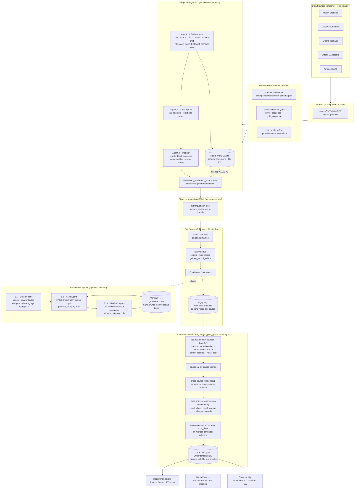
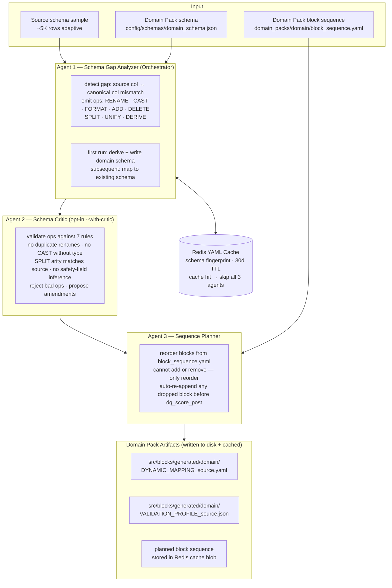
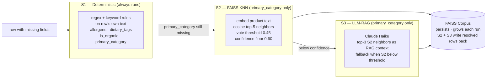

# Marketplace Intelligence Platform (MIP)

**Course:** DAMG 7245 — Big Data Systems and Intelligent Analytics · Spring 2026 · Group 5

MIP is a domain-agnostic data intelligence platform. Point it at any structured data source, supply a domain schema, and it automatically generates YAML transforms, runs a Bronze → Silver → Gold ETL pipeline, enriches missing fields, scores data quality, and makes every run observable and queryable.

The food catalog (USDA, OpenFoodFacts, OpenFDA, Amazon ESCI) is the **reference implementation** — five incompatible source schemas onboarded without a single line of hand-written ingestion code.

**Live:** `35.239.47.242` — see [Live Endpoints](#live-endpoints).

---

## Architecture

Every source flows through a **Domain Pack** (schema + block sequence) into a three-agent LangGraph pipeline, producing Silver Parquet per source. Gold runs in two stages: per-source dedup+enrich → BigQuery, then cross-source concat+dedup → GCS canonical Parquet.



### Domain Pack structure

```
domain_packs/<domain>/
├── block_sequence.yaml      # silver_sequence · sequence · gold_sequence
└── custom_blocks/*.py       # optional domain-specific Block subclasses

config/schemas/<domain>_schema.json   # canonical column definitions
src/blocks/generated/<domain>/        # DYNAMIC_MAPPING_<source>.yaml  (auto-generated)
                                      # VALIDATION_PROFILE_<source>.json
```

Six domains shipped: `nutrition` · `safety` · `retail` · `pricing` · `finance` · `manufacturing`. Add a new domain → author a schema JSON + block_sequence.yaml, run the CLI once.

---

## Agentic Flows

The three agents run inside LangGraph and produce **Domain Pack artifacts** — the YAML transform files and planned block sequences that all subsequent pipeline runs replay deterministically.



| Agent | Model | What it produces |
|---|---|---|
| **Schema Gap Analyzer** | `deepseek/deepseek-chat` | YAML op list; writes `DYNAMIC_MAPPING_<source>.yaml`; on first run derives and writes domain schema |
| **Schema Critic** *(opt-in)* | `claude-sonnet-4-6` | Validated/amended op list; rejects ops that violate safety rules or structural constraints |
| **Sequence Planner** | `deepseek/deepseek-chat` | Ordered block sequence; complete Redis cache blob (single write site in `plan_sequence_node`) |

---

## Enrichment Cascade

Cost-ordered deterministic cascade — not agentic. Runs inside `LLMEnrichBlock` during Gold execution.



> **Hard safety rule.** `allergens`, `is_organic`, `dietary_tags` — S1 extraction only, never touched by S2 or S3. `LLMEnrichBlock` post-run assertion fires if this is ever crossed — fix the cause, never silence it.

---

## Prerequisites

- Python 3.11+, Poetry
- Docker + Docker Compose
- GCP: GCS buckets `mip-bronze-2024` / `mip-silver-2024`, BigQuery project `mip-platform-2024`
- API keys: `ANTHROPIC_API_KEY`, `DEEPSEEK_API_KEY`, `GROQ_API_KEY`

---

## Setup

```bash
git clone https://github.com/BigDataIA-Spring26-MIP/Marketplace-Intelligence-Platform.git
cd Marketplace-Intelligence-Platform

cp .env.example .env          # fill API keys + GOOGLE_APPLICATION_CREDENTIALS

poetry install

docker-compose -p mip up -d   # Kafka, Airflow, Postgres, Prometheus, Pushgateway,
                               # Grafana, ChromaDB, Redis, MLflow

# One-time: seed enrichment corpus from USDA FoodData Central
poetry run python scripts/build_corpus.py --limit 10000
```

---

## Running

### Demo (fastest way to see it work)

```bash
poetry run python demo.py
# Runs USDA → FDA → FDA replay; third pass shows Redis cache skipping all 3 agents
```

### CLI — run any source

```bash
# Local CSV
poetry run python -m src.pipeline.cli --source data/usda_fooddata_sample.csv --domain nutrition

# GCS JSONL (silver mode — schema transform only, no enrichment)
poetry run python -m src.pipeline.cli \
    --source "gs://mip-bronze-2024/off/2026/04/22/*.jsonl" --mode silver

# Resume after failure
poetry run python -m src.pipeline.cli --source data/fda_recalls_sample.csv --domain safety --resume

# Enable Agent 2 critic
poetry run python -m src.pipeline.cli --source data/usda_fooddata_sample.csv --domain nutrition --with-critic
```

### Gold layer

```bash
poetry run python -m src.pipeline.gold_pipeline --source off --date 2026/04/21
# Reads all Silver Parquet for source+date → dedup + enrichment → BigQuery mip_gold.products
```

### Streamlit wizard

```bash
poetry run streamlit run app.py
# http://localhost:8501
# Sidebar tabs: Pipeline (HITL gates) | Observability (RAG chatbot) | MLflow | EDA
```

### Services

```bash
# MCP observability API
uvicorn src.uc2_observability.mcp_server:app --host 0.0.0.0 --port 8001
# Swagger: http://localhost:8001/docs

# REST API (pipeline + search + recommendations)
uvicorn src.api.main:app --host 0.0.0.0 --port 8002
# Swagger: http://localhost:8002/docs
```

### Pipeline modes

| Mode | What runs | Output |
|---|---|---|
| `full` (default) | DQ pre → YAML transforms → clean → dedup → enrich → DQ post | CSV to `output/` |
| `silver` | Schema transform only | Parquet to GCS |
| `gold` | Dedup + enrichment + DQ on Silver Parquet | Append to BigQuery |

### Tests

```bash
poetry run pytest
poetry run pytest -m "not integration"   # skip GCS-dependent tests
cd src && ruff check .
```

Coverage: **81.72%** across 920 tests, 43 test files.

---

## Live Endpoints

| Service | URL | Credentials |
|---|---|---|
| Streamlit App | http://35.239.47.242:8502 | — |
| Airflow | http://35.239.47.242:8080 | `admin` / `admin` |
| Grafana | http://35.239.47.242:3000 | `admin` / `mip_admin` |
| MLflow | http://35.239.47.242:5000 | — |
| Prometheus | http://35.239.47.242:9090 | — |
| MCP Server | http://35.239.47.242:8001/docs | — |
| REST API | http://35.239.47.242:8002/docs | — |
| ChromaDB | http://35.239.47.242:8000 | — |

---

## Repo Layout

```
src/
├── agents/              # LangGraph nodes, prompts, guardrails
├── blocks/generated/    # YAML transforms per domain (auto-created on first run)
├── cache/               # Redis + SQLite fallback
├── enrichment/          # S1 deterministic · S2 KNN · S3 LLM-RAG + FAISS corpus
├── models/              # LiteLLM wrappers (5 task getters)
├── pipeline/            # runner, CLI, checkpoint manager
├── uc2_observability/   # metrics, chunker, RAG chatbot, MCP server, MLflow bridge
├── uc3_search/          # BM25 + FAISS hybrid search
└── uc4_recommendations/ # association rules + graph recommender

airflow/dags/            # 9 DAGs: ingest → Bronze → Silver → Gold → anomaly + chunker
config/schemas/          # canonical target schemas (6 domains)
```

---

## Work Disclosure

> **WE ATTEST THAT WE HAVEN'T USED ANY OTHER STUDENTS' WORK IN OUR ASSIGNMENT AND ABIDE BY THE POLICIES LISTED IN THE STUDENT HANDBOOK.**

| Member | Contribution | Share |
|---|---|---|
| **Bhavya Likhitha** | Three-agent LangGraph flow; YAML mapping I/O; Redis cache + SQLite fallback; chunked streaming runner; checkpoint/resume; MLflow integration; MCP server for Claude Desktop | **33.3%** |
| **Aqeel** | UC2 observability plane (Prometheus, anomaly detection, ChromaDB chunker, Kafka→Postgres, MCP FastAPI server); three-tier enrichment cascade with allergen safety boundary; all 9 Airflow DAGs | **33.3%** |
| **Deepika** | Domain schema design and registration; source bootstrap path; enrichment + DQ column extensions; hybrid search indexer and evaluator; association-rule and graph recommendation engine; project documentation | **33.3%** |

**AI tools used:** Claude Code (architecture, scaffolding, MCP server, Streamlit UI, debugging), OpenGPT (prompt engineering, Airflow templates), GitHub Codex (boilerplate, test stubs), DeepSeek Chat (data processing utilities, cache client). All AI-generated code was reviewed and tested. Safety-field boundary violations suggested by AI were rejected and replaced with explicit guards.
